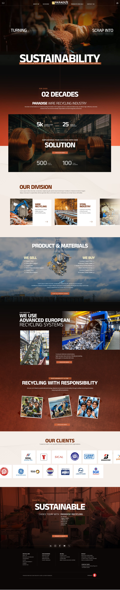

# Paradise Wire Recycling Industry - Website

A modern, responsive website for Paradise Wire Recycling Industry built with React, showcasing sustainable recycling solutions and state-of-the-art European technology.



## 🚀 Features

- **Responsive Design**: Fully responsive layout optimized for all devices
- **Modern UI/UX**: Clean, professional design with smooth animations
- **Accessibility**: ARIA labels, keyboard navigation, and focus management
- **Interactive Components**: 
  - Animated counter statistics with Intersection Observer
  - Client carousel with Swiper
  - Mobile-friendly mega menu with focus trap
  - Smooth scroll navigation
- **Performance Optimized**: Built with Vite for fast development and production builds

## 📁 Project Structure

```
paradise-new/
├── src/
│   ├── components/
│   │   ├── Header.jsx              # Navigation header with hamburger menu
│   │   ├── Header.css
│   │   ├── MegaMenu.jsx            # Mobile menu overlay with focus trap
│   │   ├── MegaMenu.css
│   │   ├── Hero.jsx                # Hero section with main tagline
│   │   ├── Hero.css
│   │   ├── Stats.jsx               # Animated statistics section
│   │   ├── Stats.css
│   │   ├── Divisions.jsx           # Division cards (Wire, Steel, Trading)
│   │   ├── Divisions.css
│   │   ├── ProductMaterials.jsx    # WE SELL / WE BUY section
│   │   ├── ProductMaterials.css
│   │   ├── Machines.jsx            # European recycling systems
│   │   ├── Machines.css
│   │   ├── Responsibility.jsx      # Gallery with tilted images
│   │   ├── Responsibility.css
│   │   ├── ClientsCarousel.jsx     # Client logos carousel
│   │   ├── ClientsCarousel.css
│   │   ├── Footer.jsx              # Footer with contact info
│   │   └── Footer.css
│   ├── assets/
│   │   └── images/                 # Image assets directory
│   ├── App.jsx                     # Main app component
│   ├── main.jsx                    # React entry point
│   └── index.css                   # Global styles
├── public/                         # Static assets
├── index.html                      # HTML template
├── package.json                    # Dependencies and scripts
└── vite.config.js                  # Vite configuration
```

## 🛠️ Technologies

- **React 19.2.0** - UI library
- **Vite 7.2.4** - Build tool and dev server
- **react-intersection-observer** - Scroll animations
- **Swiper 12.0.3** - Touch-enabled carousel
- **ESLint** - Code linting

## 📦 Installation

```bash
# Install dependencies
npm install

# Start development server
npm run dev

# Build for production
npm run build

# Preview production build
npm run preview

# Run linter
npm run lint
```

## 🎨 Components Overview

### Header
- Fixed navigation bar with logo
- Desktop navigation menu
- Hamburger menu for mobile
- Smooth scroll to sections

### MegaMenu
- Full-screen mobile menu overlay
- Focus trap for accessibility
- Keyboard navigation support (ESC to close)
- Animated menu items

### Hero
- Full-viewport hero section
- Animated typography
- Gradient text effects
- Scroll indicator

### Stats
- Animated counters with Intersection Observer
- 2 decades of experience highlight
- Key metrics display (5K+ employees, 25+ countries, etc.)

### Divisions
- Card grid layout
- Wire Recycling, Steel Industry, Metal Trading
- Hover effects and animations
- Learn more buttons

### ProductMaterials
- Split layout: WE SELL / WE BUY
- Material lists with bullet points
- Central icon with pulse animation
- Get a quote CTA

### Machines
- European technology showcase
- Feature cards (Efficiency, Eco-friendly, Automation, Safety)
- Machine visualization
- Detailed descriptions

### Responsibility
- Tilted photo gallery effect
- Responsive image layout
- Impact messaging
- Social responsibility focus

### ClientsCarousel
- Auto-playing carousel
- Touch/swipe enabled
- Responsive breakpoints
- Dynamic pagination

### Footer
- Multi-column layout
- Quick links and services
- Contact information
- Social media links
- Copyright and legal links

## 🎯 Key Features Implementation

### Animations
- Fade-in effects on scroll using `react-intersection-observer`
- Smooth transitions and transforms
- Staggered animations for list items

### Accessibility
- Semantic HTML elements
- ARIA labels and roles
- Keyboard navigation
- Focus management in modals
- Screen reader friendly

### Responsive Design
- Mobile-first approach
- Breakpoints: 768px, 1024px
- Flexible grid layouts
- Touch-friendly interactions

## 🌈 Color Scheme

```css
--primary-orange: #ff6b35
--dark-brown: #3d2516
--light-beige: #f5f1ed
--dark-bg: #1a1a1a
--accent-red: #d32f2f
```

## 📱 Browser Support

- Chrome (latest)
- Firefox (latest)
- Safari (latest)
- Edge (latest)

## 🚀 Deployment

The project can be deployed to any static hosting service:

```bash
npm run build
# Upload the 'dist' folder to your hosting service
```

Recommended platforms:
- Vercel
- Netlify
- GitHub Pages
- Cloudflare Pages

## 📄 License

Copyright © 2024 Paradise Wire Recycling Industry. All rights reserved.

## 🤝 Contributing

This is a proprietary project for Paradise Wire Recycling Industry.

---

Built with ❤️ using React and Vite
